---
## Front matter
title: "ОТЧЕТ О ВЫПОЛНЕНИИ ЛАБОРАТОРНОЙ РАБОТЫ №3"
subtitle: "_дисциплина: Архитектура компьютера_"
author: "Лихтенштейн Алина Алексеевна"

## Generic otions
lang: ru-RU
toc-title: "Содержание"

## Bibliography
bibliography: bib/cite.bib
csl: pandoc/csl/gost-r-7-0-5-2008-numeric.csl

## Pdf output format
toc: true # Table of contents
toc-depth: 2
lof: true # List of figures
lot: false # List of tables
fontsize: 12pt
linestretch: 1.5
papersize: a4
documentclass: scrreprt
## I18n polyglossia
polyglossia-lang:
  name: russian
  options:
	- spelling=modern
	- babelshorthands=true
polyglossia-otherlangs:
  name: english
## I18n babel
babel-lang: russian
babel-otherlangs: english
## Fonts
mainfont: PT Serif
romanfont: PT Serif
sansfont: PT Sans
monofont: PT Mono
mainfontoptions: Ligatures=TeX
romanfontoptions: Ligatures=TeX
sansfontoptions: Ligatures=TeX,Scale=MatchLowercase
monofontoptions: Scale=MatchLowercase,Scale=0.9
## Biblatex
biblatex: true
biblio-style: "gost-numeric"
biblatexoptions:
  - parentracker=true
  - backend=biber
  - hyperref=auto
  - language=auto
  - autolang=other*
  - citestyle=gost-numeric
## Pandoc-crossref LaTeX customization
figureTitle: "Рис."
tableTitle: "Таблица"
listingTitle: "Листинг"
lofTitle: "Список иллюстраций"
lotTitle: "Список таблиц"
lolTitle: "Листинги"
## Misc options
indent: true
header-includes:
  - \usepackage{indentfirst}
  - \usepackage{float} # keep figures where there are in the text
  - \floatplacement{figure}{H} # keep figures where there are in the text
---

# Цель работы

Цель данной лабораторной работы — изучить идеологию и применение средств контроля версий git, а также приобрести практические навыки по работе с этой системой.

# Выполнение лабораторной работы

Создадим учётную запись на сайте https://github.com/ и заполним основные данные (рис. [-@fig:fig1])

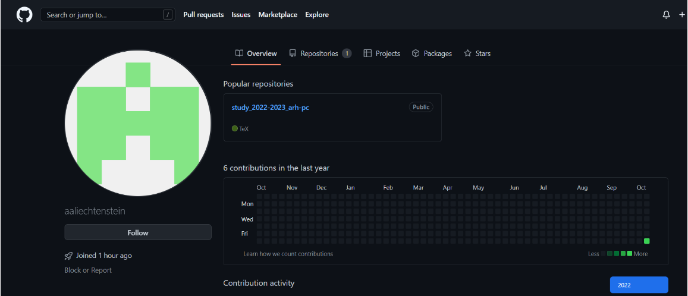{ #fig:fig1 width=70% }

Сделаем предварительную конфигурацию git. Откроем терминал и введем следующие команды, указав имя и email владельца репозитория. Настроим utf-8 в выводе сообщений git. Зададим имя начальной ветки. Введем параметры autocrlf и safecrlf (рис. [-@fig:fig2])

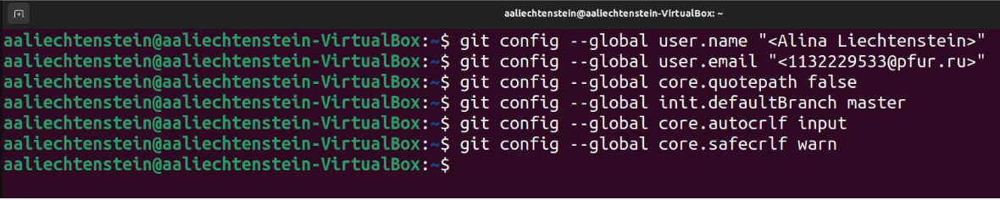{ #fig:fig2 width=70% }

Для последующей идентификации пользователя на сервере репозиториев сгенерируем пару ключей (приватный и открытый) (рис. [-@fig:fig3])

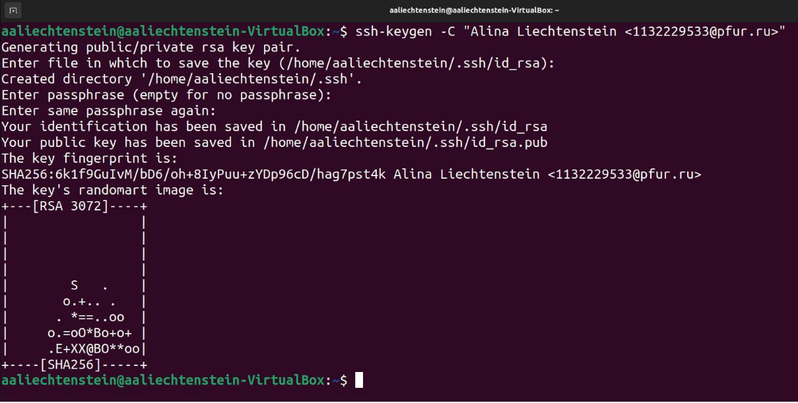{ #fig:fig3 width=70% }

Добавим сгенерированный SSH ключ в профиль Github (рис. [-@fig:fig4])

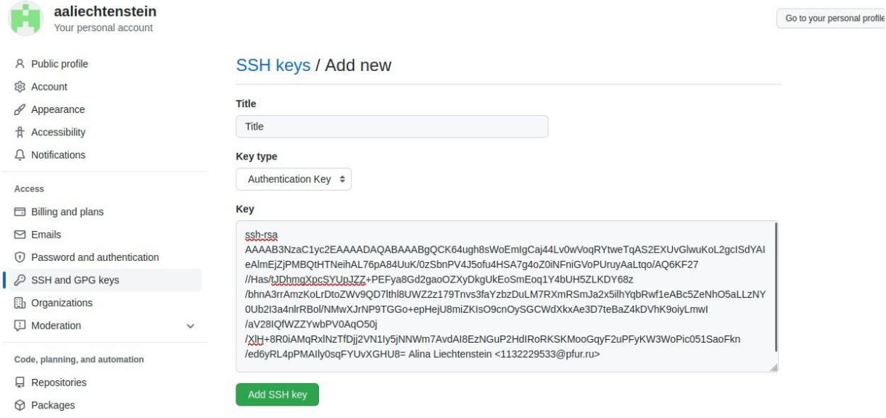{ #fig:fig4 width=70% }

Откроем терминал и создадим каталог для предмета «Архитектура компьютера» (рис. [-@fig:fig5])

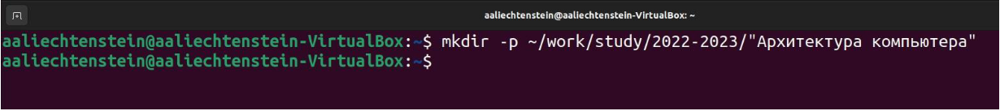{ #fig:fig5 width=70% }

Создадим репозиторий на основе шаблона через web-интерфейс github. Зададим имя репозитория (Repository name) study_2022–2023_arh-pc (рис. [-@fig:fig6])

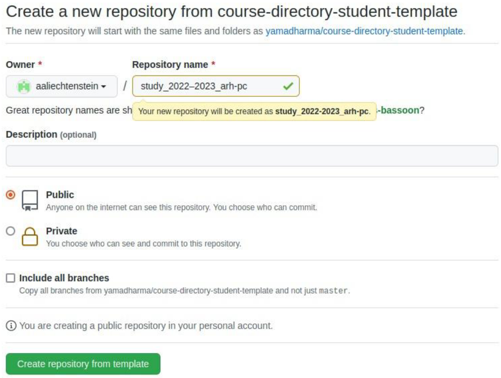{ #fig:fig6 width=70% }

Клонируем созданный репозиторий (рис. [-@fig:fig7])

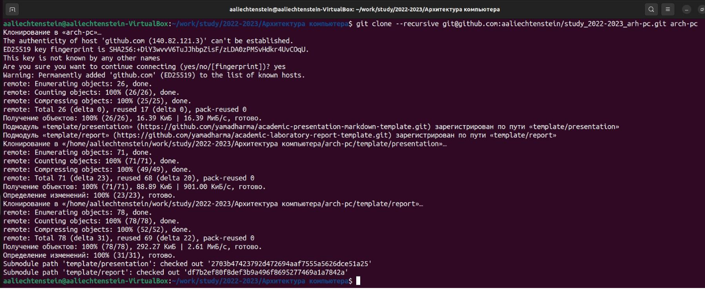{ #fig:fig7 width=70% }

Настроим каталог курса. Удалим лишние файлы и создадим необходимые каталоги (рис. [-@fig:fig8])

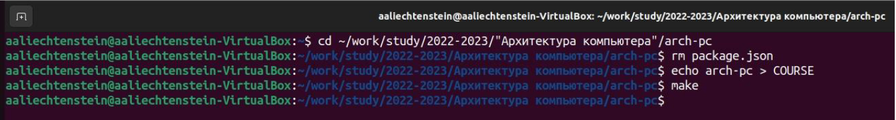{ #fig:fig8 width=70% }

Отправим файлы на сервер (рис. [-@fig:fig9], [-@fig:fig10], [-@fig:fig11])

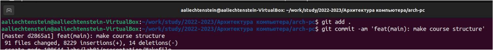{ #fig:fig9 width=70% }

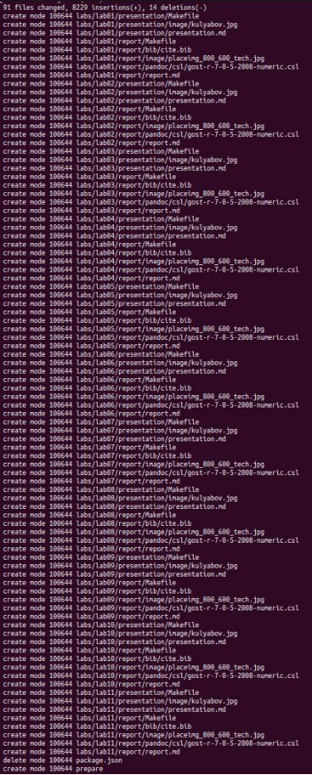{ #fig:fig10 width=70% }

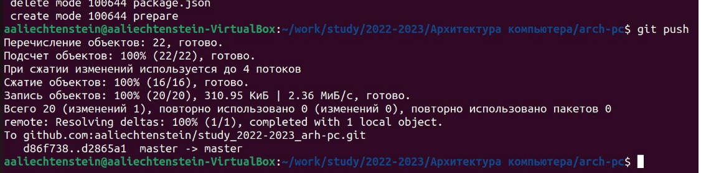{ #fig:fig11 width=70% }

# Выполнение заданий для самостоятельной работы

Скопируем отчеты по выполнению предыдущих лабораторных работ в соответствующие каталоги созданного рабочего пространства (рис. [-@fig:fig12])

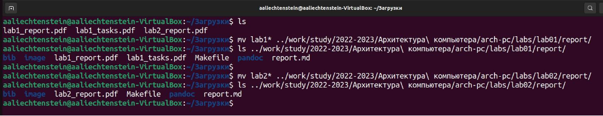{ #fig:fig12 width=70% }

Отправим файлы на сервер (рис. [-@fig:fig13])

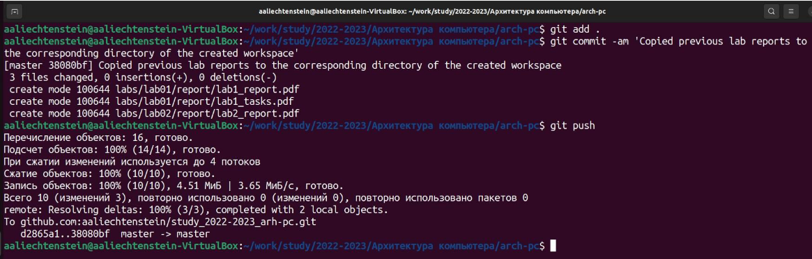{ #fig:fig13 width=70% }

# Выводы

В ходе выполнения данной лабораторной работы мы изучили идеологию и применение средств контроля версий git, а также приобрели практические навыки по работе с этой системой.
