---
## Front matter
title: "ОТЧЕТ О ВЫПОЛНЕНИИ ЛАБОРАТОРНОЙ РАБОТЫ №8"
subtitle: "_дисциплина: Архитектура компьютера_"
author: "Лихтенштейн Алина Алексеевна"

## Generic otions
lang: ru-RU
toc-title: "Содержание"

## Bibliography
bibliography: bib/cite.bib
csl: pandoc/csl/gost-r-7-0-5-2008-numeric.csl

## Pdf output format
toc: true # Table of contents
toc-depth: 2
lof: true # List of figures
lot: false # List of tables
fontsize: 12pt
linestretch: 1.5
papersize: a4
documentclass: scrreprt
## I18n polyglossia
polyglossia-lang:
  name: russian
  options:
	- spelling=modern
	- babelshorthands=true
polyglossia-otherlangs:
  name: english
## I18n babel
babel-lang: russian
babel-otherlangs: english
## Fonts
mainfont: PT Serif
romanfont: PT Serif
sansfont: PT Sans
monofont: PT Mono
mainfontoptions: Ligatures=TeX
romanfontoptions: Ligatures=TeX
sansfontoptions: Ligatures=TeX,Scale=MatchLowercase
monofontoptions: Scale=MatchLowercase,Scale=0.9
## Biblatex
biblatex: true
biblio-style: "gost-numeric"
biblatexoptions:
  - parentracker=true
  - backend=biber
  - hyperref=auto
  - language=auto
  - autolang=other*
  - citestyle=gost-numeric
## Pandoc-crossref LaTeX customization
figureTitle: "Рис."
tableTitle: "Таблица"
listingTitle: "Листинг"
lofTitle: "Список иллюстраций"
lotTitle: "Список таблиц"
lolTitle: "Листинги"
## Misc options
indent: true
header-includes:
  - \usepackage{indentfirst}
  - \usepackage{float} # keep figures where there are in the text
  - \floatplacement{figure}{H} # keep figures where there are in the text
---

# Цель работы

Изучение команд условного и безусловного переходов. Приобретение навыков написания программ с использованием переходов. Знакомство с назначением и структурой файла листинга.

# Выполнение лабораторной работы

Создадим каталог для программ лабораторной работы №8, перейдем в него и создадим файл lab8-1.asm. (рис. [-@fig:fig1])

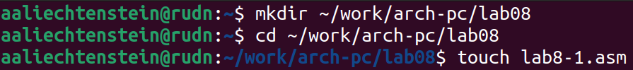{ #fig:fig1 width=70% }

Рассмотрим пример программы с использованием инструкции jmp. Введем в файл lab8-1.asm текст программы из листинга 8.1. (рис. [-@fig:fig2])

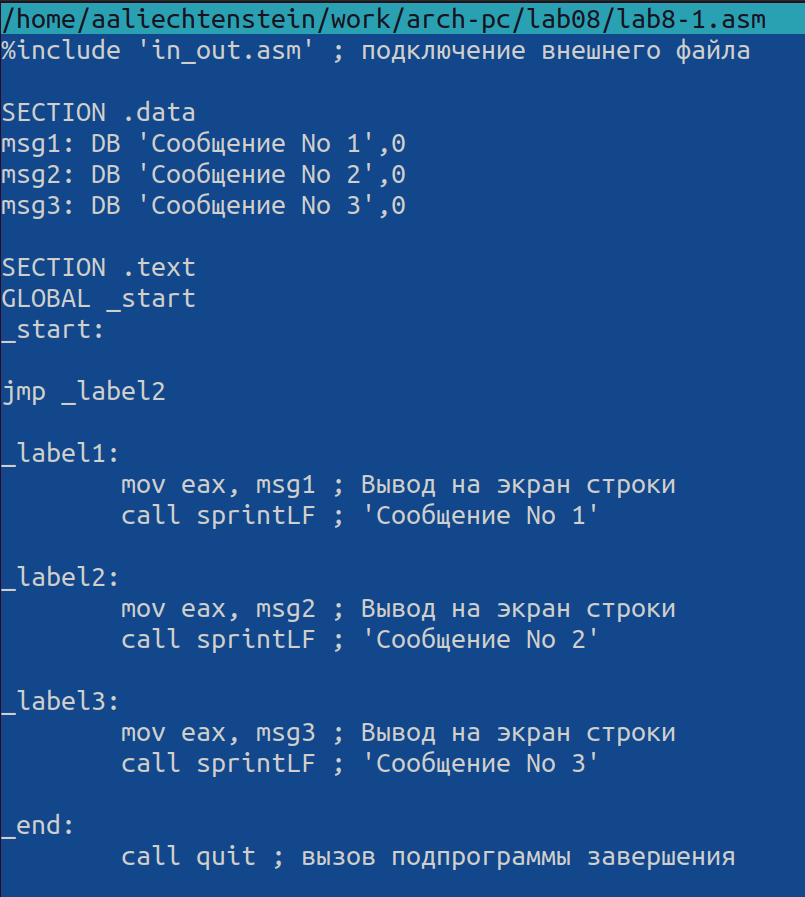{ #fig:fig2 width=70% }

Создадим исполняемый файл и запустим его. Результат работы данной программы будет следующим: (рис. [-@fig:fig3])

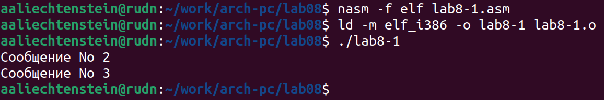{ #fig:fig3 width=70% }

Изменим текст программы в соответствии с листингом 8.2. (рис. [-@fig:fig4])

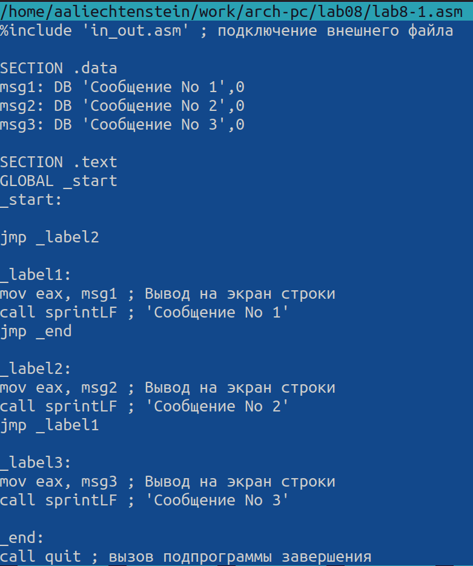{ #fig:fig4 width=70% }

Создадим исполняемый файл и проверим его работу. (рис. [-@fig:fig5]) 

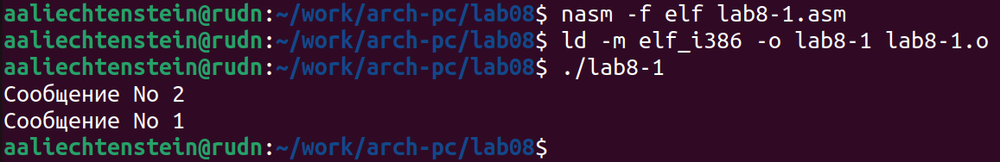{ #fig:fig5 width=70% }

Изменим текст программы, добавив инструкции jmp, чтобы вывод программы был следующим: (рис. [-@fig:fig6], [-@fig:fig7]) 

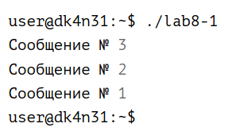{ #fig:fig6 width=70% }

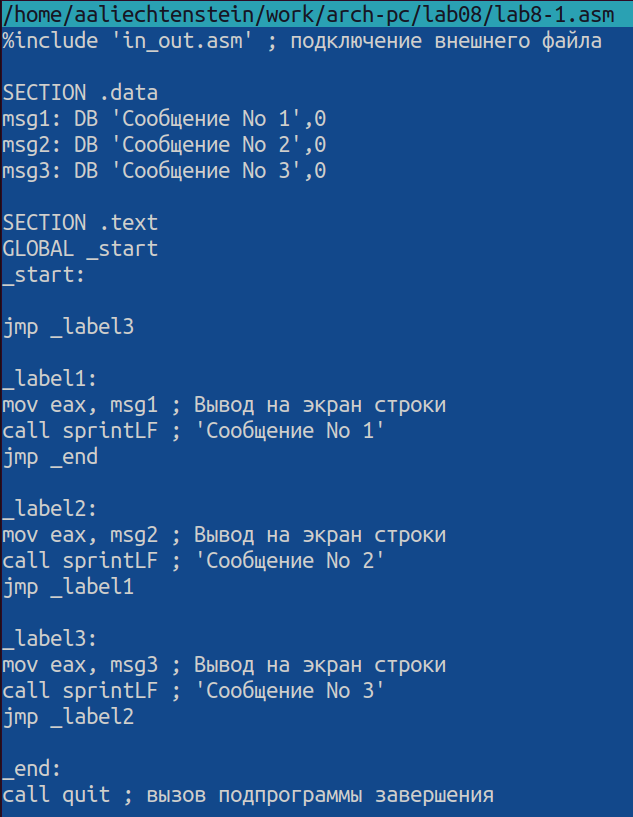{ #fig:fig7 width=70% }

Создадим исполняемый файл и проверим его работу. (рис. [-@fig:fig8]) 

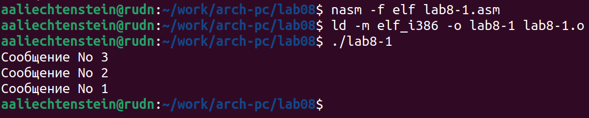{ #fig:fig8 width=70% }

Создайте файл lab8-2.asm в каталоге ~/work/arch-pc/lab08. (рис. [-@fig:fig9]) 

{ #fig:fig9 width=70% }

Внимательно изучив текст программы из листинга 8.3, введем его в lab8-2.asm. (рис. [-@fig:fig10]) 

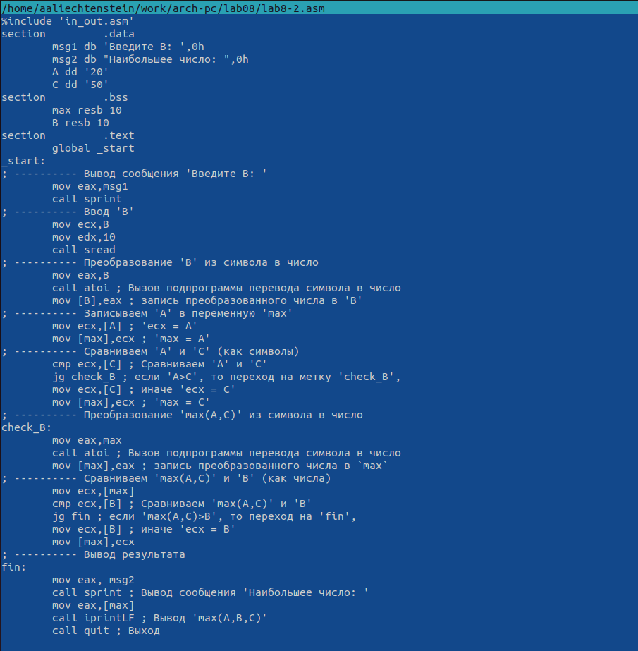{ #fig:fig10 width=70% }

Создадим исполняемый файл и проверим его работу для разных значений B. (рис. [-@fig:fig11]) 

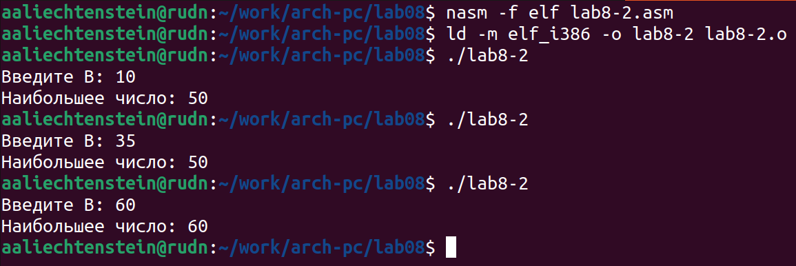{ #fig:fig11 width=70% }

Обычно nasm создаёт в результате ассемблирования только объектный файл. Получить файл листинга можно, указав ключ -l и задав имя файла листинга в командной строке. 
Создадим файл листинга для программы из файла lab8-2.asm. (рис. [-@fig:fig12]) 

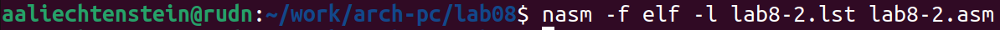{ #fig:fig12 width=70% }

Откроем файл листинга lab8-2.lst с помощью текстового редактора mcedit. (рис. [-@fig:fig13], [-@fig:fig14]) 

{ #fig:fig13 width=70% }

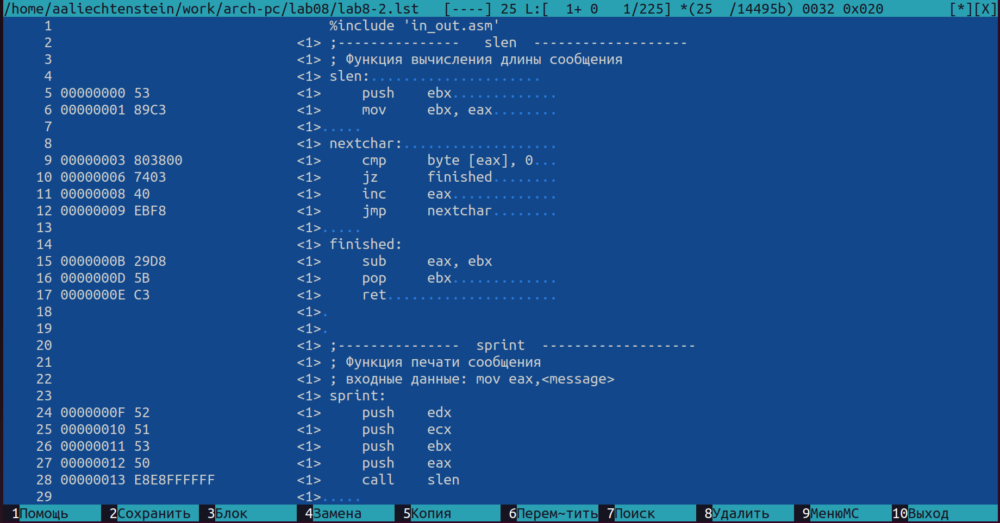{ #fig:fig14 width=70% }

Внимательно ознакомимся с его форматом и содержимым.
Подробно объясним содержимое трёх строк файла листинга по выбору. (рис. [-@fig:fig15])

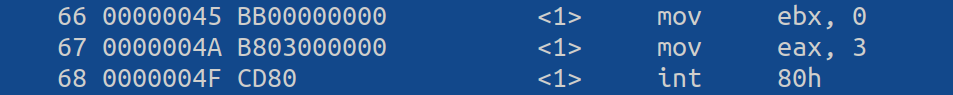{ #fig:fig15 width=70% }

Инструкция mov ebx, 0 начинается по смещению 00000045 в сегменте кода; далее идёт машинный код, в который ассемблируется инструкция, то есть инструкция mov ebx, 0 ассемблируется в BB00000000 (в шестнадцатеричном представлении);

Инструкция mov eax, 3 начинается по смещению 0000004A в сегменте кода; далее идёт машинный код, в который ассемблируется инструкция, то есть инструкция int 80h ассемблируется в B803000000;

Инструкция int 80h начинается по смещению 0000004F в сегменте кода; далее идёт машинный код, в который ассемблируется инструкция, то есть инструкция int 80h ассемблируется в CD80; CD80 — это инструкция на машинном языке, вызывающая прерывание ядра);

Откроем файл с программой lab8-2.asm и в любой инструкции с двумя операндами удалим один операнд. (рис. [-@fig:fig16], [-@fig:fig17])

![Операнд [B] не удален](image/16.png){ #fig:fig16 width=70% }

![Операнд [B] удален](image/17.png){ #fig:fig17 width=70% }

Выполним трансляцию с получением файла листинга. (рис. [-@fig:fig18])

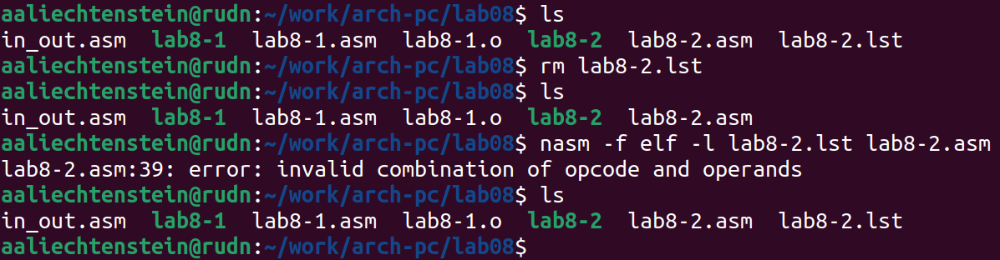{ #fig:fig18 width=70% }

Компилятор выводит ошибку: error: invalid combination of opcode and operands. Создается такой же файл листинга, но только с удаленным операндом. (рис. [-@fig:fig19])

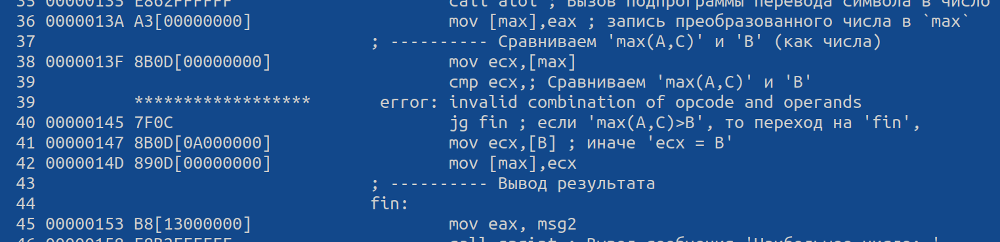{ #fig:fig19 width=70% }

# Выполнение заданий для самостоятельной работы

1. Напишем программу нахождения наименьшей из 3 целочисленных переменных a, b и c (Вариант 14: a = 81, b = 22, c = 72). (рис. [-@fig:fig20], [-@fig:fig21], [-@fig:fig22])

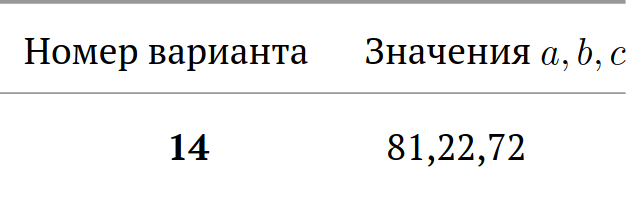{ #fig:fig20 width=70% }

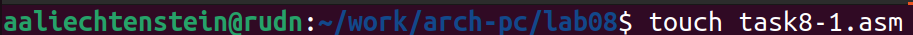{ #fig:fig21 width=70% }

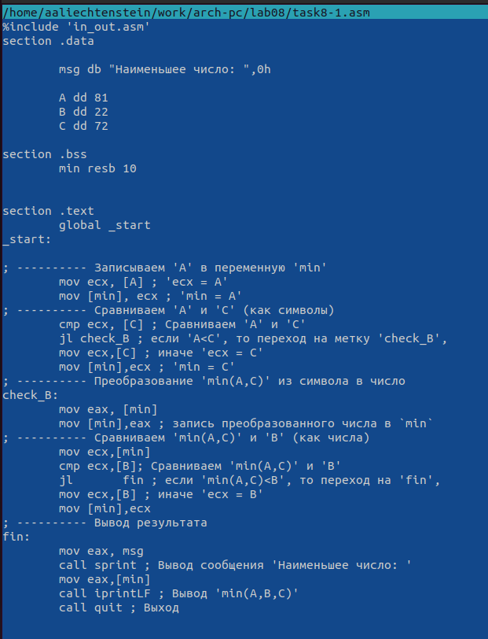{ #fig:fig22 width=70% }

Создадим исполняемый файл и проверим его работу. (рис. [-@fig:fig23])

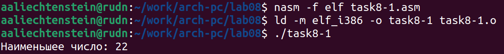{ #fig:fig23 width=70% }

Вывод программы правильный.

2. Напишем программу, которая для введенных с клавиатуры значений x и a вычисляет значение заданной функции f(x) и выводит результат вычислений. (рис. [-@fig:fig24], [-@fig:fig25], [-@fig:fig26])

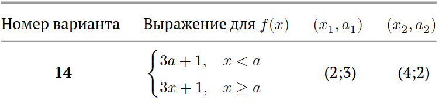{ #fig:fig24 width=70% }

{ #fig:fig25 width=70% }

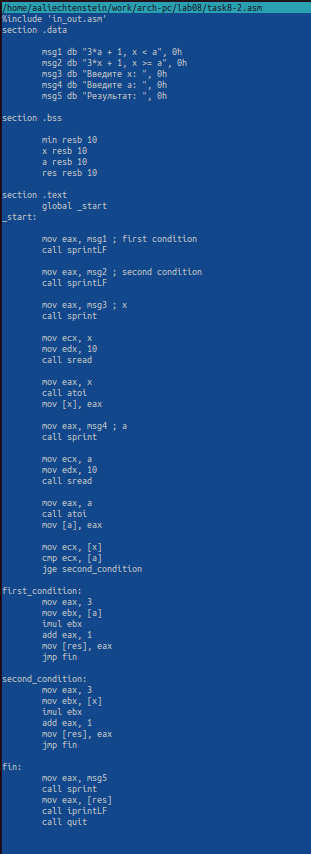{ #fig:fig26 width=70% }

Создайте исполняемый файл и проверьте его работу для значений x и a (Вариант 14: {x = 2, a = 3}, {x = 4, a = 2}). (рис. [-@fig:fig27])

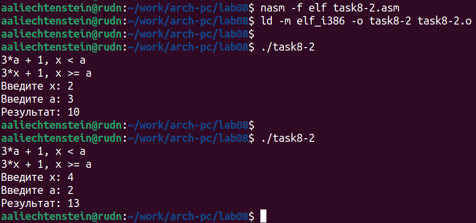{ #fig:fig27 width=70% }

# Выводы

В процессе выполнения лабораторной работы были изучены команды условного и безусловного переходов, назначение и структура файла листинга. Приобретены навыки написания программ с использованием переходов.
